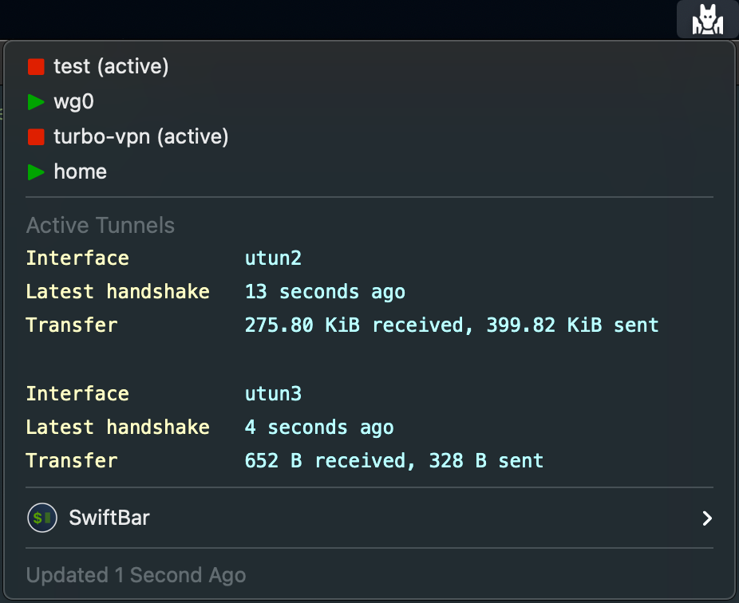

# SwiftBar Plugins

## Usage

## Plugins

#### `wireguard-manager.sh`

Manages one or more connections to a WireGuard VPN.

**Requires** : python3,wireguard-go,wireguard-tools

## Attributions

Icons from [www.flaticon.com](www.flaticon.com) made by:

- Freepik

