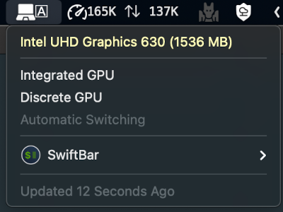
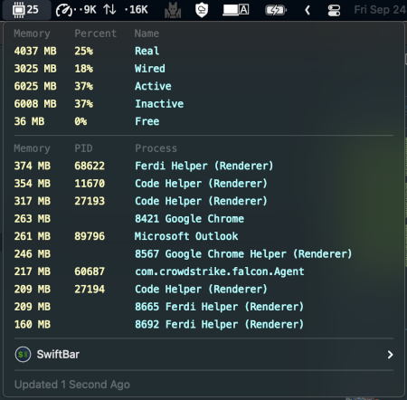
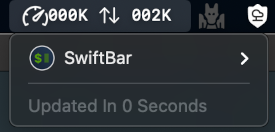

# SwiftBar Plugins

## Usage

## Plugins

### gpu-toggle.py

Displays the active GPU and allows selecting integrated, dedicated or automatic switching.

### memory-usage.py

Shows the current system memmory usage and top 10 processes.

### network-bandwidth.sh

Displays the current download/upload bandwidth.

**Requires** : ifstat

### wireguard-manager.sh

Manages one or more connections to a WireGuard VPN.

**Requires** : wireguard-go,wireguard-tools

## Color Reference

- GRAY: `#3c3c3c`
- RED: `#d40000`
- YELLOW: `#ffcc00`
- GREEN: `#009800`

## Attributions

Icons from [www.flaticon.com](www.flaticon.com) made by:

- Freepik

