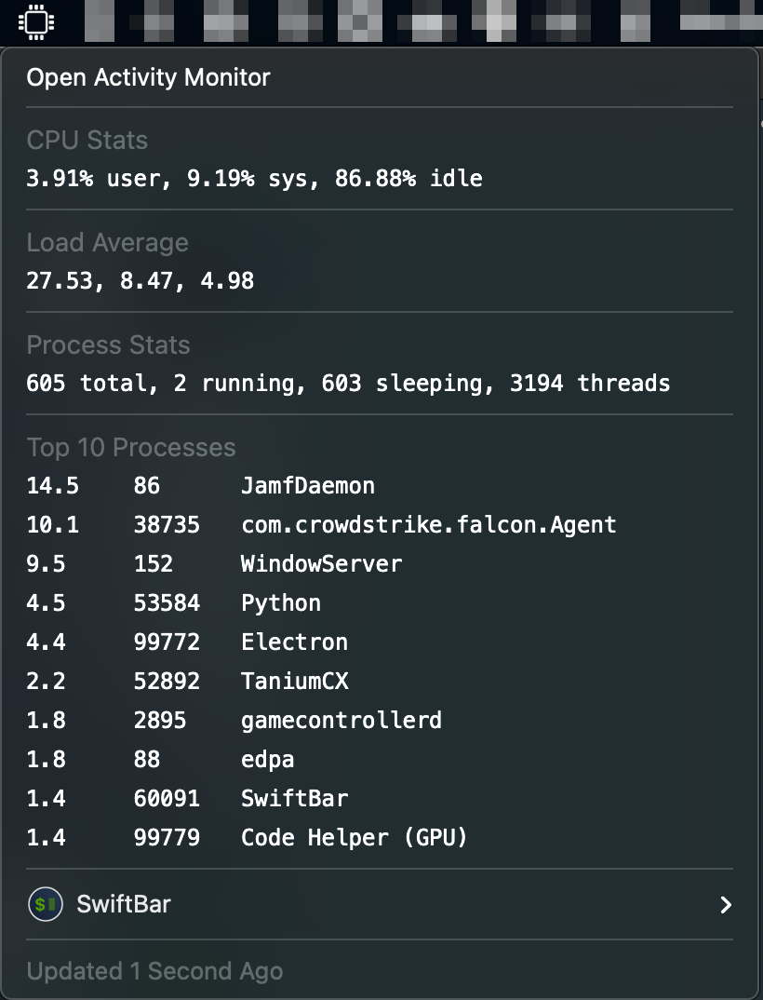

#  CPU Monitor

## Metadata

| key           | value                                                             |
|---------------|-------------------------------------------------------------------|
| title         | CPU Monitor                                                       |
| version       | v1.0                                                              |
| author        | Rob Arango                                                        |
| author.github | rarango9                                                          |
| desc          | Displays the current CPU usage and top 10 consuming processes.    |
| image         | https://github.com/rarango9/swiftbar-plugin-cpu-monitor/image.png |
| dependencies  | python3,procps,top                                                |
| abouturl      | https://github.com/rarango9/swiftbar-plugin-cpu-monitor/README.md |

## Optional Metadata

| key               | value   |
|-------------------|---------|
| hideAbout         | true    |
| hideRunInTerminal | true    |
| hideLastUpdated   | false   |
| hideDisablePlugin | true    |
| hideSwiftBar      | false   |

## Screenshot

