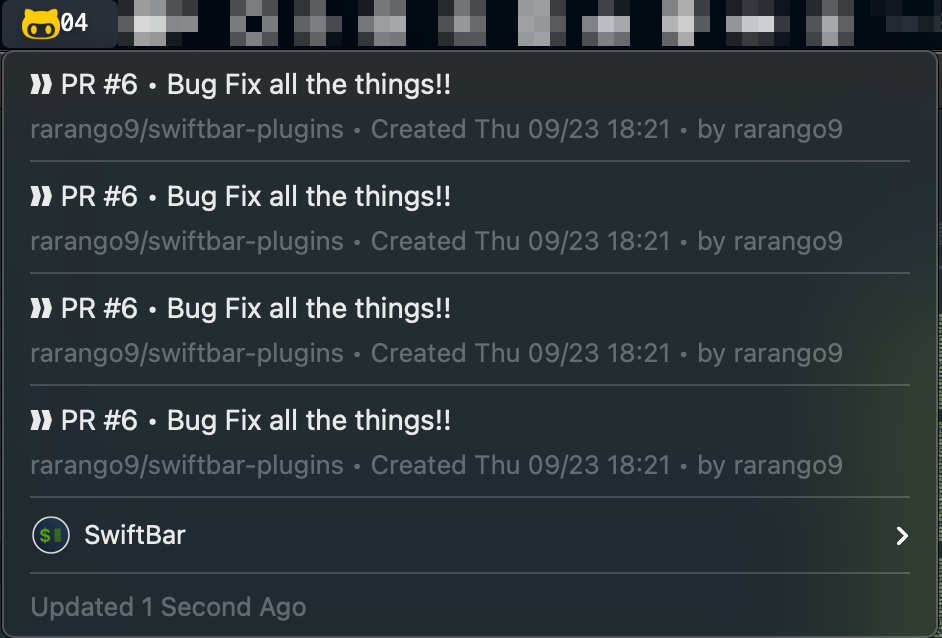

# github-requested-reviews

## Metadata

| key           | value                                                                                                             |
|---------------|-------------------------------------------------------------------------------------------------------------------|
| title         | Github Requested Reviews                                                                                          |
| version       | v1.0                                                                                                              |
| author        | Rob Arango                                                                                                        |
| author.github | rarango9                                                                                                          |
| desc          | Retrieves any Pull Requests that require peer review from GitHub/GitHub Enterprise using a Personal Access Token. |
| image         | https://github.com/rarango9/swiftbar-plugins/github-requested-reviews/screenshot.png                              |
| dependencies  | python3                                                                                                           |
| abouturl      | https://github.com/rarango9/swiftbar-plugins/github-requested-reviews/README.md                                   |

## Optional Metadata

| key               | value                                                                           |
|-------------------|---------------------------------------------------------------------------------|
| hideAbout         | true                                                                            |
| hideRunInTerminal | true                                                                            |
| hideLastUpdated   | false                                                                           |
| hideDisablePlugin | true                                                                            |
| hideSwiftBar      | false                                                                           |
| environment       | [SB_GRR_ACCESS_TOKEN:, SB_GRR_GITHUB_LOGIN:, SB_GRR_GITHUB_HOSTNAME:github.com] |

## Screenshot

