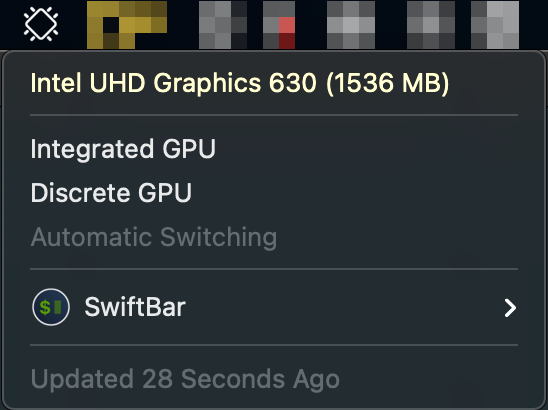

#  GPU Toggle

## Metadata

| key           | value                                                                                      |
|---------------|--------------------------------------------------------------------------------------------|
| title         | GPU Toggle                                                                                 |
| version       | v1.0                                                                                       |
| author        | Rob Arango                                                                                 |
| author.github | rarango9                                                                                   |
| desc          | Displays the active GPU and allows selecting integrated, dedicated or automatic switching. |
| image         | https://github.com/rarango9/swiftbar-plugin-gpu-toggle/screenshot.png                      |
| dependencies  | python3,pmset,system_profiler                                                              |
| abouturl      | https://github.com/rarango9/swiftbar-plugin-gpu-toggle/README.md                           |

## Optional Metadata

| key               | value   |
|-------------------|---------|
| hideAbout         | true    |
| hideRunInTerminal | true    |
| hideLastUpdated   | false   |
| hideDisablePlugin | true    |
| hideSwiftBar      | false   |

## Screenshot

