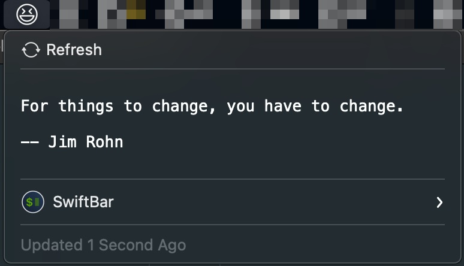

#  Jokes and Quotes

## Metadata

| key           | value                                                                  |
|---------------|------------------------------------------------------------------------|
| title         | Jokes and Quotes                                                       |
| version       | v1.0                                                                   |
| author        | Rob Arango                                                             |
| author.github | rarango9                                                               |
| desc          | Grabs a random joke or quote on each execution.                        |
| image         | https://github.com/rarango9/swiftbar-plugin-jokes-and-quotes/image.png |
| dependencies  | python3                                                                |
| abouturl      | https://github.com/rarango9/swiftbar-plugin-jokes-and-quotes/README.md |

## Optional Metadata

| key               | value   |
|-------------------|---------|
| hideAbout         | true    |
| hideRunInTerminal | true    |
| hideLastUpdated   | false   |
| hideDisablePlugin | true    |
| hideSwiftBar      | false   |

## Screenshot

