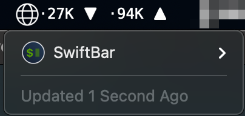

#  Network Monitor

## Metadata

| key           | value                                                                 |
|---------------|-----------------------------------------------------------------------|
| title         | Network Monitor                                                       |
| version       | v1.0                                                                  |
| author        | Rob Arango                                                            |
| author.github | rarango9                                                              |
| desc          | Displays the current bandwidth and other network information.         |
| image         | https://github.com/rarango9/swiftbar-plugin-network-monitor/image.png |
| dependencies  | python3,ifstat                                                        |
| abouturl      | https://github.com/rarango9/swiftbar-plugin-network-monitor/README.md |

## Optional Metadata

| key               | value   |
|-------------------|---------|
| hideAbout         | true    |
| hideRunInTerminal | true    |
| hideLastUpdated   | false   |
| hideDisablePlugin | true    |
| hideSwiftBar      | false   |

## Screenshot

