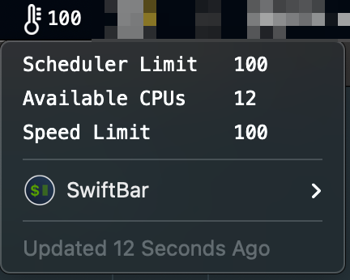

#  Thermal Throttle Monitor

## Metadata

| key           | value                                                                          |
|---------------|--------------------------------------------------------------------------------|
| title         | Thermal Throttle Monitor                                                       |
| version       | v1.0                                                                           |
| author        | Rob Arango                                                                     |
| author.github | rarango9                                                                       |
| desc          | Monitors if the CPU is thermal throttling.                                     |
| image         | https://github.com/rarango9/swiftbar-plugin-thermal-throttle-monitor/image.png |
| dependencies  | python3                                                                        |
| abouturl      | https://github.com/rarango9/swiftbar-plugin-thermal-throttle-monitor/README.md |

## Optional Metadata

| key               | value   |
|-------------------|---------|
| hideAbout         | true    |
| hideRunInTerminal | true    |
| hideLastUpdated   | false   |
| hideDisablePlugin | true    |
| hideSwiftBar      | false   |

## Screenshot

