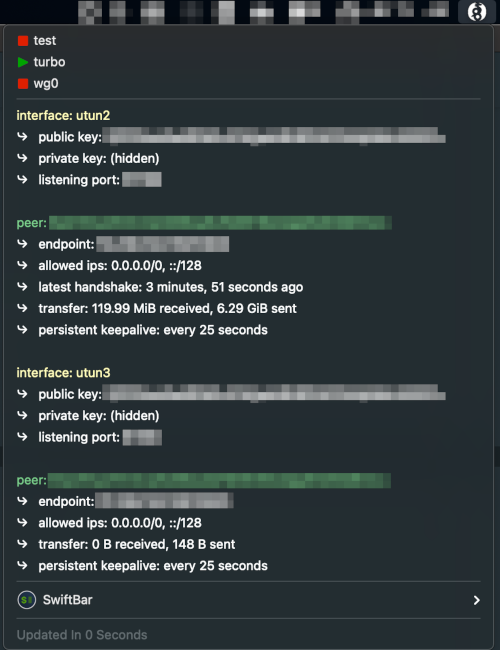

#  Wireguard Manager

## Metadata

| key           | value                                                                   |
|---------------|-------------------------------------------------------------------------|
| title         | Wireguard Manager                                                       |
| version       | v1.0                                                                    |
| author        | Rob Arango                                                              |
| author.github | rarango9                                                                |
| desc          | Manages one or more connections to a WireGuard VPN.                     |
| image         | https://github.com/rarango9/swiftbar-plugin-wireguard-manager/image.png |
| dependencies  | python3,wireguard-go,wireguard-tools                                    |
| abouturl      | https://github.com/rarango9/swiftbar-plugin-wireguard-manager/README.md |

## Optional Metadata

| key               | value   |
|-------------------|---------|
| hideAbout         | true    |
| hideRunInTerminal | true    |
| hideLastUpdated   | false   |
| hideDisablePlugin | true    |
| hideSwiftBar      | false   |

## Screenshot

