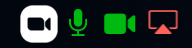

#  Zoom Indicators

## Metadata

| key           | value                                                                 |
|---------------|-----------------------------------------------------------------------|
| title         | Zoom Indicators                                                       |
| version       | v1.0                                                                  |
| author        | Rob Arango                                                            |
| author.github | rarango9                                                              |
| desc          | Displays indicators for zoom mic, video and screenshare.              |
| image         | https://github.com/rarango9/swiftbar-plugin-zoom-indicators/image.png |
| dependencies  | AppleScript                                                           |
| abouturl      | https://github.com/rarango9/swiftbar-plugin-zoom-indicators/README.md |

## Optional Metadata

| key               | value   |
|-------------------|---------|
| hideAbout         | true    |
| hideRunInTerminal | true    |
| hideLastUpdated   | false   |
| hideDisablePlugin | true    |
| hideSwiftBar      | false   |

## Screenshot

